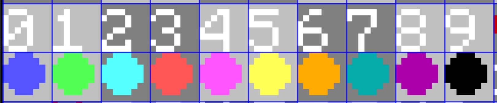

# lodestone
A Navigation HUD which can track multiple locations uniquely for each player

>[!warning]
>Replaces white_background bossbar texture
>
>Forceloads chunk 0 0

>[!important]
>Needs supplementary Resourcepack

## Download
Get the latest Datapack and Resourcepack from releases!

## Usage

* To start the HUD on a player, make them run the following function:
```mcfunction
function lode:api/start
```

* To stop the HUD on a player, make them run the following function:
```mcfunction
function lode:api/stop
```

* To add a marker to the HUD, follow the example below, and run the second command as the player:
```mcfunction
data modify storage lode:api marker set value {pos:[0,0,0],dim:"minecraft:overworld",color:"1",id:spawn,display:'{"text":"Spawn","color":"green"}'}
function lode:api/marker/set
```
* The color codes for markers are given below


* To remove a marker, run the following command as the player:
```mcfunction
function lode:api/marker/remove {id:"spawn"}
```

* To clear all markers, run the following command as the player:
```mcfunction
function lode:api/marker/clear
```

* To get a list of the player's current markers, run the following command as the player:
```mcfunction
function lode:api/marker/clear
##Output in storage lode:api list
```

* You may toggle the presence of coordinates on the left of the hud in the following way:
```mcfunction
##Showing coords
scoreboard players set #coords lode.id 1
##Hiding coords
scoreboard players set #coords lode.id 0
```

## Credits
[Supersword's fast 3d distance calc](https://github.com/SuperSwordTW/Distance-Trig-Calc-3d)


